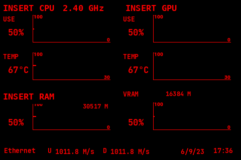

# RedLineGraphs theme for Turing Smart Screen

A minimal red-on-black system monitor theme for [`turing-smart-screen-python`](https://github.com/mathoudebine/turing-smart-screen-python), designed for **3.5 inch 480x320 landscape** USB smart screens.



## Features

- CPU usage graph
- CPU temperature graph
- GPU usage graph
- GPU temperature graph
- GPU VRAM usage graph
- RAM usage graph
- Network upload/download in a bottom taskbar-style row
- Date and time in the bottom row
- Low-resource default refresh interval: 5 seconds

## Installation

Copy the theme folder into your `turing-smart-screen-python` themes directory:

```bash
cp -r RedLineGraphs ~/turing-smart-screen-python/res/themes/
```

Then open the configuration wizard:

```bash
cd ~/turing-smart-screen-python
source .venv/bin/activate
python3 configure.py
```

Select the `RedLineGraphs` theme and run it.

## Customization

Edit:

```bash
~/turing-smart-screen-python/res/themes/RedLineGraphs/theme.yaml
```

Change these labels to match your hardware:

```yaml
static_text:
  TEXT_CPU:
    TEXT: INSERT CPU

  TEXT_GPU:
    TEXT: INSERT GPU

  TEXT_MEMORY:
    TEXT: INSERT RAM
```

For example:

```yaml
TEXT_CPU:
  TEXT: Ryzen 7 5800X

TEXT_GPU:
  TEXT: RTX 4070 SUPER

TEXT_MEMORY:
  TEXT: 32GB DDR4
```

If the text overlaps with the frequency or the graph, shorten the label or move the `X` coordinate.

## Refresh interval

Most sections are set to refresh every **5 seconds** to reduce CPU usage:

```yaml
INTERVAL: 5
```

For smoother CPU/GPU/network updates, change selected sections back to:

```yaml
INTERVAL: 1
```

## Notes

- This theme uses the JetBrains Mono font path included in `turing-smart-screen-python`: `jetbrains-mono/JetBrainsMono-Bold.ttf`.
- Do not copy font files into this repository unless you are sure the license allows redistribution.
- If your network values do not appear, check your network interface selection in `configure.py`.

## License

MIT License. See [`LICENSE`](LICENSE).
